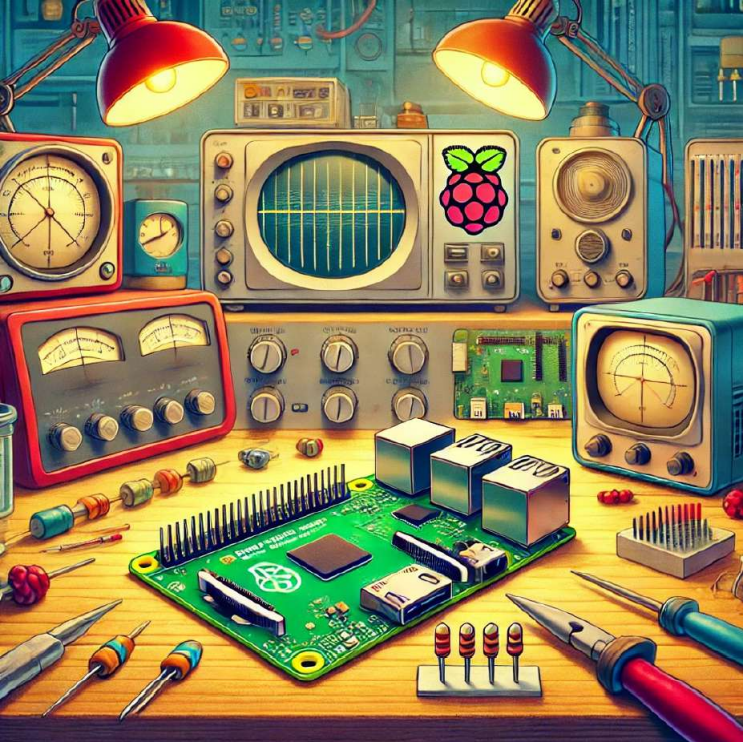

# projet-IA-2.0

  <a href="https://www.raspberrypi.org/computers">
    <!-- Image locale : affichage OK sur GitHub + GitHub Pages -->
    
  </a>

#### ✳️ Slogan Projet IA 2.0
**Démocratiser l’IA par l’enseignement, la créativité et le plaisir d’apprendre.** - **Un projet libre, exigeant, et profondément humain.** - **L’éducation repose sur la confiance. Quand elle existe, les projets prennent tout leur sens.**  

#### 🧭 Synthèse Projet IA 2.0

<table>
  <thead>
    <tr>
      <th>Élément</th>
      <th>Phrase clé</th>
    </tr>
  </thead>
  <tbody>
    <tr><td><b>Mission</b></td><td>Democratize AI – L’IA pour tous</td></tr>
    <tr><td><b>Mantra</b></td><td>Change the World with AI</td></tr>
    <tr><td><b>Saut de courbe</b></td><td>Teach differently with technology</td></tr>
    <tr><td><b>Qualité</b></td><td>Deep • Intelligent • Complete • Empowering • Elegant</td></tr>
    <tr><td><b>Esprit</b></td><td>Don’t worry, be crappy</td></tr>
    <tr><td><b>Ouverture</b></td><td>Let hundred flowers blossom</td></tr>
    <tr><td><b>Positionnement</b></td><td>Polarize people</td></tr>
    <tr><td><b>Résilience</b></td><td>Churn, baby, churn</td></tr>
    <tr><td><b>Niche</b></td><td>Low cost, high value</td></tr>
    <tr><td><b>Pitch</b></td><td>10 slides, 20 min, 30 idées</td></tr>
    <tr><td><b>Conviction</b></td><td>Don’t let the bozos grind you down</td></tr>
  </tbody>
</table>

[You 're right !](https://youtu.be/VNGFep6rncY?si=nYJm1ob12RWcnMFv) - [Innovation ! ](https://youtu.be/Mtjatz9r-Vc?si=qMR0apdlt54by1X4) - [Valley of Death !](https://youtu.be/QLuqXctU_IQ?si=lBmejYNtvQyk0PhJ)  

---

### 🌍 Projet IA 2.0 — Vision et philosophie

#### 🎯 1. Mission : *Democratize AI*
Rendre l’intelligence artificielle accessible à tous.  
**L’IA pour tous, pas pour une élite.**

---

#### 💡 2. Mantra : *Change the World with AI*
Le **Projet IA 2.0** veut transformer l’enseignement en donnant à chacun les outils du XXIᵉ siècle.  
**Change the world. Change it for good, for better, for all.**

---

#### 🚀 3. Saut de courbe : *Teach Differently*
Enseigner autrement : passer de la théorie abstraite à l’expérimentation concrète.
- **Python**, **OpenCV**, **YOLO**, **Raspberry Pi**  
- La **computer vision** appliquée aux mathématiques  
- Le **mode projet**, la **créativité**, et la **liberté pédagogique**

---

#### 🎲 4. Qualités du projet : *DICEE*
- **Deep** : riche en usages réels  
- **Intelligent** : pensé avec rigueur et sens  
- **Complete** : prêt à l’emploi, documenté, simple à utiliser  
- **Empowering** : valorise professeurs et élèves  
- **Elegant** : clair, soigné, esthétiquement agréable

---

#### ⚡ 5. Esprit de version : *Don’t Worry, Be Crappy*
L’innovation, c’est le mouvement. La version 2.0 naît de l’expérience, des erreurs et de la volonté d’améliorer.  

---

#### 🌸 6. Ouverture : *Let Hundred Flowers Blossom*
**S’ils s’en inspirent, c’est gagné.**

---

#### ⚖️ 7. Positionnement : *Polarize People*
**Pas de neutralité quand il s’agit d’innover.**

---

#### 🔁 8. Résilience : *Churn, Baby, Churn*
Continuer, évoluer, réinventer. Toujours plus clair, plus libre, plus cohérent.  
**L’innovation est un processus, pas un instant.**

---

#### 🎯 9. Niche : *Low Cost – High Value* (my weakness my strength)
Basé sur l’ingéniosité, la pédagogie et l’open hardware.  
**Zéro euro, zéro contrainte, 100 % impact.**

---

#### 🗣️ 10. Présentation : *Perfect Your Pitch*
10 slides. 20 minutes. 30 idées.  

---

#### 💪 11. Conviction : *Don’t Let the Bozos Grind You Down*
Ne pas se laisser impressionner par les sceptiques, les hiérarchies ou les “experts”.  
**Croire, tenir, transmettre.**

---

### Le projet IA 2.0 appliqué à la Computer Vision - 🔒  
### Le projet IA 2.0 appliqué à l'Edge AI - 🔒
